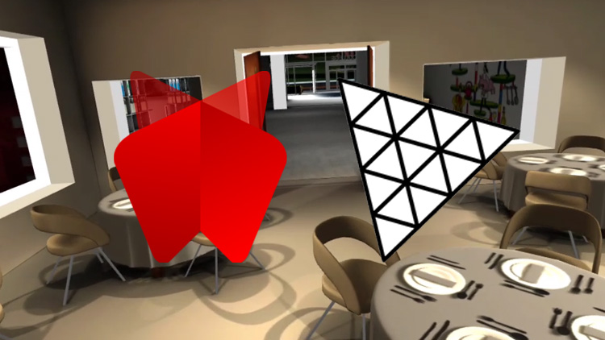
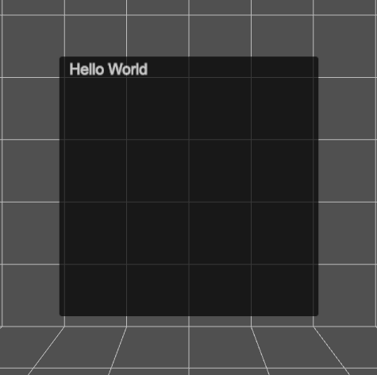
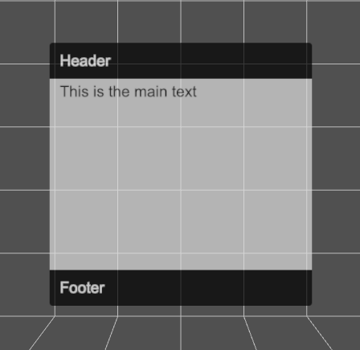
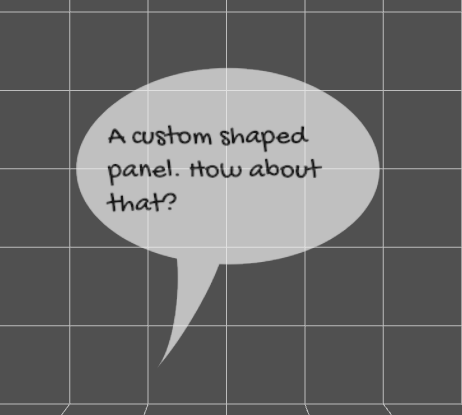
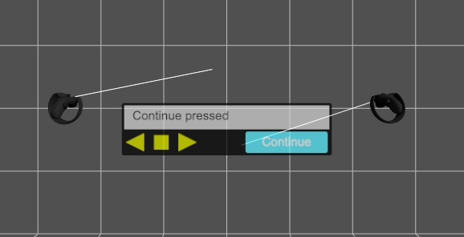
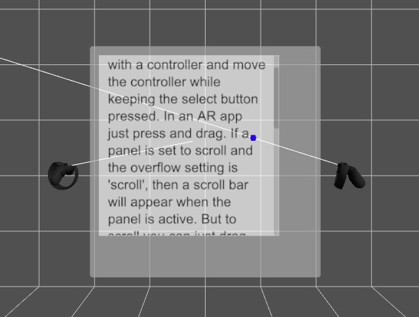
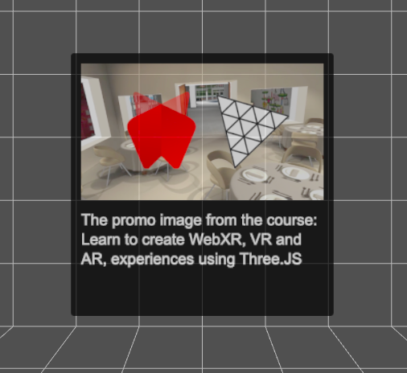
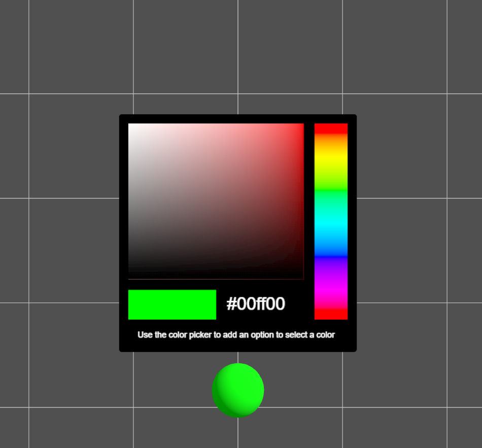

<h1 align="center">CanvasUI</h1>

<h4 align="center">A Three.JS WebXR UI. Enabling easy UI creation for immersive-vr sessions</h4>

<h4 align="center">



</h4>

## Use CanvasUI
<details>
<summary>Get Started</summary>
<h4></h4>

[CanvasUI tutorial (youtube) ](https://www.youtube.com/playlist?list=PLFky-gauhF45P5qrGOljUFm3a6HtX5Mfr) 


> [ONLINE DEMO](https://niksgames.com/webxr/dev/CanvasUI/simple/)

First, make sure to import **CanvasUI**
```
import { CanvasUI } from '../../jsm/CanvasUI.js'
```

Your file structure needs both `three.module.js` and `CanvasKeyboard.js` to be accessible. The repo has the file structure like the Three.js library with the Three.js build loaded from CDN, and extra content in the examples folder. The CanvasUI examples are in the examples/CanvasUI. The class files are in examples/jsm. 

To create a simple text panel use :
```
const ui = new CanvasUI(  );
ui.mesh.position.set(0, -0.5, -1);
ui.updateElement("body", "Hello World" );

scene.add(ui.mesh);
```

A CanvasUI mesh is simply a plane that is 1 x 1 units. In a VR world this means it is 1 metre square. It has a *CanvasTexture* applied, by default this is 512 pixels square. An Arial font is applied and the size of the font is 30 pixels. There is 20 pixels of padding. The font color is white and the background color is black and the canvas will have 6 pixel radius rounded corners. 
</details>

<details>
<summary>Contributing</summary>
<h4></h4>
Found a bug ? Want to contribute ? Do not hesitate to open a ticket !

Please `git clone` or `download zip file` from the repo.

Use [devsrv](https://github.com/eviltik/devsrv) npm module as a webserver is welcome, explanations below. 

In VSCode, you can use [Live Server addon](https://marketplace.visualstudio.com/items?itemName=ritwickdey.LiveServer) but only for testing generated builds, or, work without `devsrv` string replacement features.


## devsrv (nodejs module)...

### ... as a webserver

`devsrv` is a custom *self signed HTTPS* (*required for webxr*) development webserver, which monitor file changes for hot reload and  handle dynamic string replacement in HTML/JS/CSS files. So you can play with different Three.js versions without spending time to replace path/url yourself. We don't use webpack atm.

Prerequies: you need to have [nodejs](https://nodejs.org/) installed on your computer.

After cloning or unzip the repo, install `CanvasUI` dependencies. 
```
$ npm install
```
It will install `devsrv` npm module in a `node_modules/` directory.

Then you can start the webserver.
```
$ npm start
```
or
```
$ node node_modules/@eviltik/devsrv/bin/devsrv.js
```

You can find all interesting `devsrv` command line options [here](https://github.com/eviltik/devsrv)

`devsrv` will search for and will use the first private IP Address found on your computer (i.e wifi or network card ip addr). After starting the server, you can use Google Chrome with WebXR addon, or simply your headset browser (i.e Oculus Browser for Oculus Quest, or Firefox Reality)

### ... as a static file builder

In HTML/JS CanvasUI lib and examples files, you can see this:

```
import * as THREE from 'https://cdn.skypack.dev/three@THREEJSVERSION';
```

`THREEJSVERSION` is a string dynamically replaced by `devsrv`. The value to replace with is defined in the configuration file `devsrv.config.json`. Thanks to `devsrv` dynamic string replacement feature, you can change the value directly in the URL, by adding "?r=0.135" in the URL, where 0.135 is the release number of threejs CDN side. If you use `devsrv` dynamic string replacement feature, you can NOT copy directly HTML files from /eaxmples directory, you need to generate static files. `devsrv` will take this point too.

To trigger a CanvasUI build :
```
$ npm build
```
or
```
$ node node_modules/@eviltik/devsrv/bin/devsrv.js -b
```

Build options are defined in `devsrv.config.json`
```
"buildOptions": {
    "src":"./examples",
    "dst":"./dist/v1.0.0/threejs.119",
    "replaceRegexp":"THREEJSVERSION",
    "defaultValue":"0.119",
    "fileRegexp":"\\.(html|js)$"
}
```

Then you can use `devsrv` (or any https webserver, vscode live server) again to serve the generated files :
```
$ node node_modules/@eviltik/devsrv/bin/devsrv.js -d ./dist/v1.0.0/threejs.119
```

</details>

## Examples
<details>
  <summary>Panel : Header, Main, Footer</summary>
<h4></h4>



> [ONLINE DEMO](https://niksgames.com/webxr/dev/CanvasUI/panel/)

In general CanvasUI is designed to have a content object and a config object. Let's try an example with multiple elements. 
```
const config = {
	header:{
		type: "text",
		position:{ top:0 },
		paddingTop: 30,
		height: 70
	},
	main:{
		type: "text",
		position:{ top:70 },
		height: 372, // default height is 512 so this is 512 - header height (70) - footer height (70)
		backgroundColor: "#bbb",
		fontColor: "#000"
	},
	footer:{
		type: "text",
		position:{ bottom:0 },
		paddingTop: 30,
		height: 70
	}
}

const content = {
	header: "Header",
	main: "This is the main text",
	footer: "Footer"
}

const ui = new CanvasUI( content, config );
```
Each element has a section in the config and the content objects. Notice that these are all of type **text**. We can set the position using x, y, left, top, right and bottom. The values are in relation to a default texture that is 512 pixels square. Colors are defined like css values. If an attribute is missing it will be inherited from the body which has these defaults.

```
defaultconfig = {
	panelSize: { width: 1, height: 1},
	width: 512,
	height: 512,
	opacity: 0.7,
	body:{
		fontFamily:'Arial', 
		fontSize:30, 
		padding:20, 
		backgroundColor: '#000', 
		fontColor:'#fff', 
		borderRadius: 6
	}
}
```
</details>


<details>
  <summary>Panel : Custom Shaped Panels with a custom font</summary>
<h4></h4>



> [DEMO](https://niksgames.com/webxr/dev/CanvasUI/shaped/)

The default shape for a UI panel is a square or rounded rectangle. But you can define a shape using an svg path. Limitless possibilities.

```
const css = {
	body: {
        clipPath: "M 258.3888 5.4432 C 126.9744 5.4432 20.4432 81.8424 20.4432 164.4624 C 20.4432 229.1976 86.3448 284.2128 178.1016 304.8192 C 183.5448 357.696 173.2416 444.204 146.8032 476.6688 C 186.6552 431.9568 229.2288 356.5296 244.7808 313.3728 C 249.252 313.3728 253.9176 313.7616 258.3888 313.7616 C 389.8032 313.7616 496.14 246.888 496.14 164.4624 S 389.8032 5.4432 258.3888 5.4432 Z",
        backgroundColor: "#ddd",
        fontColor: "#000",
        fontFamily: "Gochi Hand"
    },
	speech: {
        type: "text",
        position: { left: 50, top: 80 },
        fontSize: 45,
        fontColor: "#000",
        width: 400,
        height: 250
    }
}

const content = {
	speech: "A custom shaped panel. How about that?"
}

const ui = new CanvasUI( content, css );
```

You can generate the code for a path using [this](https://yqnn.github.io/svg-path-editor/) online tool. 

### Custom FontS

Notice that this example uses a custom Google Font. But you can NOT just load it in the index.html page simply by using
`<link href="https://fonts.googleapis.com/css2?family=Gochi+Hand&display=swap" rel="stylesheet">`. :exclamation:

See [stackoverflow](https://stackoverflow.com/questions/69367436/load-local-font-from-assets-in-mounted-method-in-vue) :eyes: to see possible circumventions.

In this example, we use [FontFace API](https://caniuse.com/mdn-api_fontface) circumvention, waiting for the font to be loaded before initializing the application.

We need the font URL. Opening https://fonts.googleapis.com/css2?family=Gochi+Hand&display=swap give this : 
```
/* latin */
@font-face {
  font-family: 'Gochi Hand';
  font-style: normal;
  font-weight: 400;
  font-display: swap;
  src: url(https://fonts.gstatic.com/s/gochihand/v14/hES06XlsOjtJsgCkx1Pkfon_-w.woff2) format('woff2');
  unicode-range: U+0000-00FF, U+0131, U+0152-0153, U+02BB-02BC, U+02C6, U+02DA, U+02DC, U+2000-206F, U+2074, U+20AC, U+2122, U+2191, U+2193, U+2212, U+2215, U+FEFF, U+FFFD;
```

Let's use the woff2 URL from the `src` attribute as parameters of the [FontFace API](https://developer.mozilla.org/en-US/docs/Web/API/FontFace). 


```
<script type="module">
    import { App } from './app.js';

    document.addEventListener("DOMContentLoaded", function(){

        let myFont = new FontFace(
            "Gochi Hand",
            "url(https://fonts.gstatic.com/s/gochihand/v14/hES06XlsOjtJsgCkx1Pkfon_-w.woff2)"
        );

        myFont.load().then(font => {

            document.fonts.add(font);

            const app = new App();
            window.app = app;

        });
    });
</script>
```


**So, Yes ! All web fonts will work with CanvasUI.**
</details>


<details>
  <summary>Buttons</summary>
<h4></h4>



> [ONLINE DEMO](https://niksgames.com/webxr/dev/CanvasUI/buttons/)

So far we've only added text elements to the UI. In this example we'll add **buttons**. Buttons work by detecting the movement and trigger button on your VR controllers. To ensure that they work correctly, add this to the renderers animation loop. 

```
if ( renderer.xr.isPresenting ) ui.update();
```

The CanvasUI class detects your controllers but does not display them. To ensure a visual representation of the controllers. Use the usual code. For example.

```
const controllerModelFactory = new XRControllerModelFactory();

// left controller
controller = renderer.xr.getController( 0 );
scene.add( controller );
		
controllerGrip = renderer.xr.getControllerGrip( 0 );
controllerGrip.add( controllerModelFactory.createControllerModel( controllerGrip ) );
scene.add( controllerGrip );

// right controller
controller1 = renderer.xr.getController( 1 );
scene.add( controller1 );

controllerGrip1 = renderer.xr.getControllerGrip( 1 );
controllerGrip1.add( controllerModelFactory.createControllerModel( controllerGrip1 ) );
scene.add( controllerGrip1 );

// line geometry
const geometry = new THREE.BufferGeometry().setFromPoints( [ new THREE.Vector3( 0, 0, 0 ), new THREE.Vector3( 0, 0, -1 ) ] );

const line = new THREE.Line( geometry );
line.name = 'line';
line.scale.z = 10;

controller.add( line.clone() );
controller1.add( line.clone() );
```

Here is a simple example of using buttons :

```
//Make sure ui is a global scope variable
let ui;

function onPrev(){
	const msg = "Prev pressed";
	console.log(msg);
	ui.updateElement( "info", msg );
}

function onStop(){
	const msg = "Stop pressed";
	console.log(msg);
	ui.updateElement( "info", msg );
}

function onNext(){
	const msg = "Next pressed";
	console.log(msg);
	ui.updateElement( "info", msg );
}

function onContinue(){
	const msg = "Continue pressed";
	console.log(msg);
	ui.updateElement( "info", msg );
}

const config = {
	panelSize: {
        width: 2,
        height: 0.5
    },
	height: 128,
	info: {
        type: "text",
        position:{ left: 6, top: 6 },
        width: 500,
        height: 58,
        backgroundColor: "#aaa",
        fontColor: "#000"
    },
	prev: {
        type: "button",
        position:{ top: 64, left: 0 }, 
        width: 64,
        fontColor: "#bb0",
        hover: "#ff0",
        onSelect: onPrev
    },
	stop: {
        type: "button",
        position:{ top: 64, left: 64 },
        width: 64,
        fontColor: "#bb0",
        hover: "#ff0",
        onSelect: onStop
    },
	next: {
        type: "button",
        position:{ top: 64, left: 128 },
        width: 64,
        fontColor: "#bb0",
        hover: "#ff0",
        onSelect: onNext
    },
	continue: {
        type: "button",
        position:{ top: 70, right: 10 },
        width: 200,
        height: 52,
        fontColor: "#fff",
        backgroundColor: "#1bf",
        hover: "#3df",
        onSelect: onContinue
    },
	renderer
}

const content = {
	info: "",
	prev: "<path>M 10 32 L 54 10 L 54 54 Z</path>",
	stop: "<path>M 50 15 L 15 15 L 15 50 L 50 50 Z<path>",
	next: "<path>M 54 32 L 10 10 L 10 54 Z</path>",
	continue: "Continue"
}

ui = new CanvasUI( content, config );
```

We define the `panelSize`, which is in world units, metres for a VR session. We also set the panel height to 128 pixels. Width will default to 512. The width and height must be powers of 2. 

:exclamation: Panelsize can be anything but if the aspect ratio of panelSize.width/panelSize.height is different to width/height then the text will be stretched. 

If the content of a button starts with `<path>` then an svg path will be filled with the `backgroundColor`. 

Notice also in the config for a button the hover attribute is the background color to use when the controller ray is over the button. 

When buttons are used always pass the `renderer` in the config object. This ensures that CanvasUI can add events to the controllers. 
</details>

<details>
  <summary>Scrolling</summary>
<h4></h4>



> [ONLINE DEMO](https://niksgames.com/webxr/dev/CanvasUI/scrolling/)

If a section of text cannot fit in the space available then you can allow it to scroll. Because this needs to use VR controllers, you need to follow the same rules as for buttons.

1. Add `renderer` to the config object passed to the CanvasUI constructor.
2. Create a visualisation of the xr controllers in the usual way. See the buttons section for an example.
3. Add `ui.update()` to the render loop.

The most important attribute of a text type, to enable scrolling, is to use `overflow: scroll`. The default is to simply hide the text that is beyond the limits of the text element area. If you want to see a blue dot where the controller ray hits the scrolling canvas, then also pass scene in the config object.

```
const config = {
	renderer,
	scene,
	body: {
        backgroundColor: "#666"
    },
	txt: {
        type: "text",
        overflow: "scroll",
        position: { left: 20, top: 20 },
        width: 460,
        height: 400,
        backgroundColor: "#fff",
        fontColor: "#000"
    }
}

const content = {
	txt: "This is an example of a scrolling panel. Select it with a controller and move the controller while keeping the select button pressed. In an AR app just press and drag. If a panel is set to scroll and the overflow setting is 'scroll', then a scroll bar will appear when the panel is active. But to scroll you can just drag anywhere on the panel. This is an example of a scrolling panel. Select it with a controller and move the controller while keeping the select button pressed. In an AR app just press and drag. If a panel is set to scroll and the overflow setting is 'scroll', then a scroll bar will appear when the panel is active. But to scroll you can just drag anywhere on the panel."
}

ui = new CanvasUI( content, config );
```
</details>

<details>
  <summary>Images</summary>
<h4></h4>



> [ONLINE DEMO](https://niksgames.com/webxr/dev/CanvasUI/images/)

You can display an image on the UI panel using CanvasUI. It is easily added using a img type.

```
const config = {
	image: {
        type: "img",
        position: { left: 20, top: 20 },
        width: 472
    },
	info: {
        type: "text",
        position: { top: 300 }
    }
}

const content = {
	image: "../../assets/promo.jpg",
	info: "The promo image from the course: Learn to create WebXR, VR and AR, experiences using Three.JS"
}

ui = new CanvasUI( content, config );
```

Notice that the config defines the positioning and size. Here only the width is specified, the height will be calculated from the image, to maintain the correct aspect ratio. If you want the image stretched then directly entering a height value will force this. The content for the image is the path to the image, either an absolute path or relative. 
*The element name in the config and the content can be anything you choose, it does not have to be 'image'*

</details>

<details>
  <summary>Input text</summary>
<h4></h4>


> [DEMO](https://niksgames.com/webxr/dev/CanvasUI/keyboard/)

CanvasUI supports a dynamic keyboard. Specify a config type as `input-text` and on select a keyboard will be shown. In common with any button type it has the usual requirements.

1. Add `renderer` to the config object passed to the CanvasUI constructor.
2. Create a visualisation of the xr controllers in the usual way. See the buttons section for an example.
3. Add `ui.update()` to the render loop.

Input text has callbacks for onChanged and onEnter. Here is an example.

```
function onChanged( txt ){
	console.log( `message changed: ${txt}`);
}

function onEnter( txt ){
	console.log(`message enter: ${txt}`);
}

const config = {
	renderer: this.renderer,
	panelSize: { width: 1.6, height: 0.4 },
	height: 128,
	message: {
        type: "input-text",
        position: { left: 10, top: 8 },
        height: 56,
        width: 492,
        backgroundColor: "#ccc",
        fontColor: "#000",
        onChanged,
        onEnter
    },
	label: {
        type: "text",
        position: { top: 64 }
    }
}

const content = {
	message: "",
	label: "Select the panel above."
}

ui = new CanvasUI( content, config );
```
</details>

<details>
  <summary>Color Picker</summary>
<h4></h4>

> [DEMO](https://niksgames.com/webxr/dev/CanvasUI/colorPicker/)


```

function onChange(hex) {
    console.log(`Picker color changed to (${hex})`);
    myMesh.material.color.set( hex );
}

const config = {
    picker: {
        type: "picker",
        position: { left: 20, top: 20 },
        width:472,
        height:422,
        onChange
    },
    info: {
        type: "text",
        position: { left: 20, top: 452 },
        fontSize:18
    },
    opacity: 1
}
        
const content = {
    picker: "#00ff00",
    info: "Use the color picker to add an option to select a color"
}

this.ui = new CanvasUI( content, config );
```
</details>

## Links
- :eyes: [My courses](http://niklever.com/courses) 
-  [FB Three.JS Group](https://www.facebook.com/groups/nikthreejs)
-  [Twitter](https://twitter.com/NikLever)
-  [YouTube Channel](https://youtube.com/c/NikLever)
-  [nik.j.lever@gmail.com](mailto:nik.j.lever@gmail.com)


